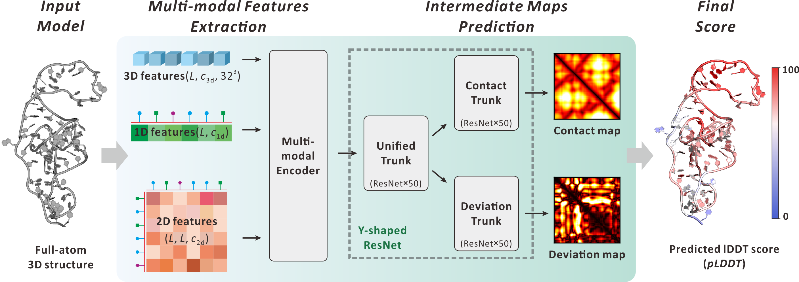

# Quality assessment of RNA 3D structure models using deep learning and intermediate 2D maps.
Overview
----
[](https://www.python.org/downloads/)  [](https://pytorch.org/)  [](https://www.pyrosetta.org/downloads)

RNArank is a deep learning framework for assessing the quality of RNA 3D structures. It employs a Y-shaped deep residual neural network that processes 1D, 2D, and 3D features extracted from an input RNA structure to predict its quality.

<p align="center">

</p>
<p align="center">
<strong>Figure 1</strong>: The overall architecture of the RNArank pipeline.
</p>

Starting from an RNA structure in PDB format, the RNArank pipeline comprises the following steps:

1. **Feature Preparation**: Extracts features from the input RNA PDB structure.
2. **Map Prediction**: A Y-shaped network processes these multi-dimensional features to predict intermediate contact and deviation maps.
3. **Score Calculation**: The predicted maps are used to derive a per-residue predicted lDDT (pLDDT) score, which reflects the local accuracy of the model.

[//]: # (We also establish a user-friendly [webserver]&#40;https://yanglab.qd.sdu.edu.cn/RNArank/&#41; for RNArank.)

Installation
----
### Step 1. Clone the repository

```bash
git clone https://github.com/YangLab-SDU/RNArank.git
cd RNArank
```
This will create a params/ directory containing the necessary model weights.

### Step 2. Environment installation
It is recommended to use `mamba` to manage the Python dependencies, which can be installed following [Mamba Installation — documentation](https://mamba.readthedocs.io/en/latest/installation/mamba-installation.html). You can use [Conda](https://www.anaconda.com/docs/getting-started/miniconda/install) instead, but Mamba is highly recommended as it's much faster. If you already have Conda installed, please install Mamba into the base environment with `conda install -n base mamba -c conda-forge` to avoid potential conflicts, rather than performing a separate Mamba installation.

Once the `mamba` is installed, a new environment can be created and activated: 
```bash
### tested on our devices with CUDA 12.4 and 11.2 ###
mamba env create -f environment.yml
mamba activate RNArank
```

### Step 3. Download the network weights
```bash
wget http://yanglab.qd.sdu.edu.cn/RNArank/download/RNArank_params.tar.gz
tar -xvzf RNArank_params.tar.gz
```
This will create a params/ directory containing the necessary model weights.

Usage
----

### Running RNArank
The main script Predict.py performs structure assessment. It supports both single-sample and batch modes.

**Predicting a Single RNA Structure**

To assess a single PDB file, provide the path to the file.

```bash
python RNArank/Predict.py --pdb ./example/example1.pdb --output_dir ./example/output/
```
RNArank will output the predicted global and per-residue lDDT scores. The results will be saved in example/output/example1_plDDT.txt.

**Predicting Multiple RNA Structures (Batch Mode)**

To assess all PDB files within a directory, provide the path to the directory.

```bash
python RNArank/Predict.py --pdb ./example/ --output_dir ./example/output/
```

For each input structure, the predicted scores will be saved to a separate .txt file within the example/output/ directory.


## Citation 

If you use RNArank in your research or work, please cite our publication: 

```
@article {Liu2025RNArank,
	title = {Quality assessment of RNA structure models using deep learning and predicted intermediate 2D maps.},
	author = {Xiaocheng Liu, Wenkai Wang, Zongyang Du, Ziyi Wang, Zhenling Peng and Jianyi Yang},
	journal = {bioRxiv},
	year = {2025},
	doi = {}
}
```

